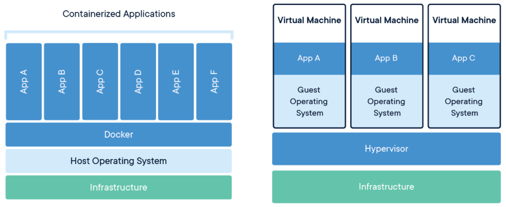
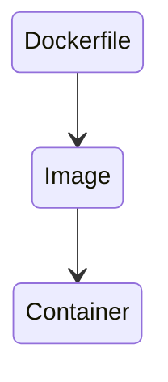

1. [~~What is Docker ?~~](#what-is-docker-)
2. [~~What is the difference with virtual machines ?~~](#what-is-the-difference-with-virtual-machines-)
3. [~~Install and Run Hello world~~](#install-and-run-hello-world)
4. [~~Play with docker~~](#play-with-docker)
5. [~~Dockerfile~~](#creating-a-dockerfile)
6. [~~Docker Images~~](#building-image)
7. [~~Docker Containers~~](#running-a-docker-image)
8. [~~Tag/Versioning~~](#tagversioning)
9. [~~Docker Cheat Sheet~~](#docker-some-other-commands)
10. Dockerize the Node application
11. Docker Compose
12. What is Docker Swarm ?
13. What is the difference with Kubernetes
14. Create and init the docker swarm cluster
15. Publish our docker image to docker hub repository
16. Docker Swarm visualizer
17. Scaling & Load Balancing
18. Monitor the docker swarm cluster
19. [Auto scaling](https://soumyadeeppaul.medium.com/auto-scaling-services-on-swarm-cd1f6fafd7ac)

# What is Docker ?

> Docker is an open source project to pack, ship and run any application as a lightweight container.
>
> Docker containers are both hardware-agnostic and platform-agnostic. This means they can run anywhere, from your laptop
> to the largest cloud compute instance and everything in between — and they don’t require you to use a particular
> language, framework or packaging system. That makes them great building blocks for deploying and scaling web apps,
> databases, and backend services without depending on a particular stack or provider. — @Docker

# Why docker ?

- Rapid application deployment
- Portability across machines
- Version control and component reuse
- Sharing of images/dockerfiles
- Lightweight footprint and minimal overhead
- Simplified maintenance

<p align="center"></p>

# What is the difference with virtual machines ?


<p align="center">Figure 1.1 | Containers and Virtual Machines | Source: Docker.com</p>

# Install and Run Hello world

Pull an image from a registry (Dockerhub)

```shell
docker pull hello-world
```

Run hello-world image

```shell
docker run hello-world
```

# Play with docker

[Docker Playground](https://labs.play-with-docker.com/)

# Some terms we will notice when working with docker

<strong>Dockerfile:</strong> A Dockerfile is a text document that contains all the commands a user could call on the
command line to assemble an image. Docker image is created using a Docker file.

<strong>Docker Images:</strong> An image is a read-only template with instructions for creating a Docker container.
Often, an image is based on another image, with some additional customization.

<strong>Docker Containers:</strong> A container is a runnable instance of an image. You can create, start, stop, move,
or delete a container using the Docker API or CLI. In addition, you can connect a container to one or more networks,
attach storage to it, or even create a new image based on its current state.



# Deploying a Node Application

# Creating a Dockerfile

Create a simple Dockerfile in the app root directory as Dockerfile (case sensitive), with no extension.

```yaml
FROM node:14.17.0-alpine

WORKDIR /app

ADD package*.json ./

RUN npm install
COPY index.js ./
CMD [ "node", "index.js"]
```

Time to explore .dockerignore. This allows you to exclude files from the context like a .gitignore file will enable you
to exclude files from your git repository.

```text
node_modules
npm-debug.log
```

# Building image

docker build -t <your-username>/<repository-name> .

```shell
docker build -t programminghero/explore-docker .
```

# Running a Docker image

docker run -p 80:8080 -d <your-username>/<repository-name>

```shell
docker run -p 80:8080 -d programminghero/explore-docker
```

-d flag is added to run the container in detached mode, leaving the container running in the background, and the -p flag
redirects a public port to a private port inside the container.

[http://localhost:8080](http://localhost:8080)

# Docker Some other commands

List all images that are locally stored with
the Docker Engine

```shell
docker image ls
```

Delete an image from the local image store
docker image rm &lt;repository-name&gt;:&lt;tag&gt;

```shell
docker image rm explore-docker:1.0
```

Stop a running container through SIGTERM

```shell
docker container stop :container_id
```

Stop a running container through SIGKILL

```shell
docker container kill :container_id
```

[Cheat sheet](https://www.docker.com/wp-content/uploads/2022/03/docker-cheat-sheet.pdf)

# Tag/Versioning

# Build v2 image of our Node Js app

# Docker Compose

Docker Compose is a tool for managing multi-container applications. Docker Compose is bundled with Docker Desktop for
Windows and Mac. On Linux, it has to be installed separately, check the installation page for details

Docker Compose can:

- Start and stop multiple containers in sequence.
- Connect containers using a virtual network.
- Handle persistence of data using Docker Volumes.
- Set environment variables.
- Build or download container images as required.

Docker Compose uses a YAML definition file to describe the whole application.

Create a file called docker-compose.yml:

```yaml
version: "3.9"
services:
  postgres:
    image: postgres
    environment:
      POSTGRES_USER: postgres
      POSTGRES_PASSWORD: postgres
    ports:
      - '5432:5432'
    volumes:
      - server-db:/var/lib/postgresql/data
  server:
    build:
      context: .
    environment:
      DB_SCHEMA: postgres
      DB_USER: postgres
      DB_PASSWORD: postgres
      DB_HOST: postgres
    depends_on:
      - postgres
    ports:
      - '3000:3000'

volumes:
  server-db:
```

Start Docker Compose and run the tests. Compose will build the image as needed and map the data volumes:

```shell
docker compose run addressbook npm test
```

We can start the app and use curl to test the endpoint:

```shell
docker compose up -d
curl -w "\n" \
       -X PUT \
       -d "firstName=Bobbie&lastName=Draper" \
       localhost:3000/persons
```

Let's check our newly created guy:

```shell
curl -w "\n" localhost:3000/persons/all
```

Perfect, now that everything works, push all the new code to GitHub:

# What is Docker Swarm ?

Docker Swarm is native clustering for Docker. It turns a pool of Docker hosts into a single, virtual host using an API
proxy system.

<strong>Lets understand what a CLUSTER mean first.</strong>
> A cluster is a set of tightly coupled computers that function like a single machine. The individual machines, called
> nodes, communicate with each other over a very fast network, and they’re physically very close together, perhaps in
> the
> same cabinet. Usually they have identical or nearly identical hardware and software. All the nodes can handle the same
> types of request. Sometimes one node takes requests and dispatches them to the others. — <strong>Phil
> Dougherty</strong>

Ok so now let’s see what we can accomplish creating a Docker Swarm Cluster:

- Multi-host networking
- Scalling
- Load Balancing
- Security by default
- Cluster management

# What is the difference with Kubernetes


# Publish our docker image to docker hub repository

```shell
docker login
docker image push programminghero/image-name
```

# Create and init the docker swarm cluster

```shell
docker swarm init
```

For deploy our stack we need to run

```shell
docker stack deploy -c docker-compose.yml swarmnodeapp
```

service and node status check:

```shell
docker service ls
docker node ls
```

# Scaling & Load Balancing

for scaling

```shell
docker service scale swarmnodeapp_nodeapp=50
```

# Docker Swarm visualizer

```shell
docker container run -p 8080:8080 -v /var/run/docker.sock:/var/run/docker.sock -d dockersamples/visualizer
```

# Monitor the docker swarm cluster

```shell
docker run --name rancher --restart=unless-stopped -p 9000:8080 -d rancher/server
```
