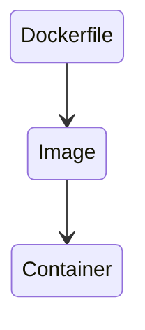

1. What is Docker ?
2. What is the difference with virtual machines ?
3. Install and Run Hello world
4. Play with docker
5. Dockerfile
6. Docker Images
7. Docker Containers
8. Tag/Versioning
9. Docker Cheat Sheet
10. ~~Docker Compose~~
11. ~~Dockerize the Node application with CI/CD~~
12. ~~What is Docker-Machine ?~~
13. ~~What is Docker Swarm ?~~
14. ~~What is the difference with Kubernetes~~
15. ~~Create and init the docker swarm cluster~~
16. ~~Publish our docker image to docker hub repository~~
17. ~~Docker Swarm visualizer~~
18. ~~Scaling & Load Balancing~~
19. ~~Monitor the docker swarm cluster~~
20. ~~Testing our setup~~

# What is Docker ?

> Docker is an open source project to pack, ship and run any application as a lightweight container.
>
> Docker containers are both hardware-agnostic and platform-agnostic. This means they can run anywhere, from your laptop
> to the largest cloud compute instance and everything in between — and they don’t require you to use a particular
> language, framework or packaging system. That makes them great building blocks for deploying and scaling web apps,
> databases, and backend services without depending on a particular stack or provider. — @Docker

# Why docker ?

- Rapid application deployment
- Portability across machines
- Version control and component reuse
- Sharing of images/dockerfiles
- Lightweight footprint and minimal overhead
- Simplified maintenance

<p align="center"></p>

# What is the difference with virtual machines ?


<p align="center">Figure 1.1 | Containers and Virtual Machines | Source: Docker.com</p>

# Install and Run Hello world

Pull an image from a registry (Dockerhub)

```shell
docker pull hello-world
```

Run hello-world image

```shell
docker run hello-world
```

# Play with docker

[Docker Playground](https://labs.play-with-docker.com/)

# Some terms we will notice when working with docker

<strong>Dockerfile:</strong> A Dockerfile is a text document that contains all the commands a user could call on the
command line to assemble an image. Docker image is created using a Docker file.

<strong>Docker Images:</strong> An image is a read-only template with instructions for creating a Docker container.
Often, an image is based on another image, with some additional customization.

<strong>Docker Containers:</strong> A container is a runnable instance of an image. You can create, start, stop, move,
or delete a container using the Docker API or CLI. In addition, you can connect a container to one or more networks,
attach storage to it, or even create a new image based on its current state.



# Deploying a Node Application

# Creating a Dockerfile

Create a simple Dockerfile in the app root directory as Dockerfile (case sensitive), with no extension.

```yaml
FROM node:14.17.0-alpine

WORKDIR /app

ADD package*.json ./

RUN npm install
COPY index.js ./
CMD [ "node", "index.js"]
```

Time to explore .dockerignore. This allows you to exclude files from the context like a .gitignore file will enable you
to exclude files from your git repository.

```text
node_modules
npm-debug.log
```

# Building image

docker build -t <your-username>/<repository-name> .

```shell
docker build -t programminghero/explore-docker .
```

# Running a Docker image

docker run -p 80:8080 -d <your-username>/<repository-name>

```shell
docker run -p 80:8080 -d programminghero/explore-docker
```

-d flag is added to run the container in detached mode, leaving the container running in the background, and the -p flag
redirects a public port to a private port inside the container.

[http://localhost:8080](http://localhost:8080)

# Docker Some other commands

List all images that are locally stored with
the Docker Engine

```shell
docker image ls
```

Delete an image from the local image store
docker image rm &lt;repository-name&gt;:&lt;tag&gt;

```shell
docker image rm explore-docker:1.0
```

Stop a running container through SIGTERM

```shell
docker container stop :container_id
```

Stop a running container through SIGKILL

```shell
docker container kill :container_id
```

[Cheat sheet](https://www.docker.com/wp-content/uploads/2022/03/docker-cheat-sheet.pdf)

# Tag/Versioning

# Build v2 image of our Node Js app

# What is Docker-Machine ?

> Docker Machine let us create Docker hosts on our computers, on cloud providers, and inside data centers. It creates
> servers, installs Docker on them, then configures the Docker client to talk to them. — @Docker#
> explore-docker-with-anwar
